<p align="center">
  
</p>

<h3 align="center">🏨 NBKRIST Hostel Portal</h3>

<p align="center">
  <i>A comprehensive, modern, and mobile-responsive hostel management system.</i><br/>
  <sub>Full-stack serverless architecture • Firebase • Real-time sync • Glassmorphism UI</sub>
</p>

<p align="center">
  
  
  
  
  
  
  <br/>
  <br/>
  <a href="https://github.com/likhith3035/hostel-portal-2/stargazers"></a>
  <a href="https://github.com/likhith3035/hostel-portal-2/network/members"></a>
  <a href="https://github.com/likhith3035/hostel-portal-2/issues"></a>
  <br/>
  <br/>
  <a href="https://app.netlify.com/start/deploy?repository=https://github.com/likhith3035/hostel-portal-2">
    
  </a>
</p>

<p align="center">
  <a href="https://nbkristhostelportal.netlify.app/">
    
  </a>
</p>

> [!NOTE]
> This is a **student academic project** developed for learning purposes. It is **NOT** the official portal of NBKR Institute of Science and Technology.

---

## 🎯 Why This Project?

> *"Designed to bridge the gap between academic theory and production-grade systems."*

This project was built to simulate a **real-world hostel management ecosystem**, focusing on scalability, security, and user experience without relying on heavy frontend frameworks.

- **Role-Based Authentication**: Secure access control for **Students**, **Admins**, and **Security Personnel**.
- **Real-Time Synchronization**: Instant updates for room bookings and complaints using **Firestore Listeners**.
- **Transaction-Safe Logic**: Preventing race conditions in room booking scenarios (double-booking protection).
- **Serverless Architecture**: Zero-backend maintenance using **Firebase** for auth, database, and hosting.
- **QR Verification System**: Cryptographically generated QR codes for secure gate entry/exit logging.

---

## ✨ Highlights

<table>
  <tr>
    <td align="center" width="25%">
      <h3>🎨</h3>
      <b>Modern UI</b><br/>
      <sub>Glassmorphism • Dark Mode<br/>Smooth Animations</sub>
    </td>
    <td align="center" width="25%">
      <h3>⚡</h3>
      <b>Real-Time</b><br/>
      <sub>Cloud Firestore<br/>Instant Sync</sub>
    </td>
    <td align="center" width="25%">
      <h3>🔒</h3>
      <b>Secure</b><br/>
      <sub>Role-Based Access<br/>Audit Logging</sub>
    </td>
    <td align="center" width="25%">
      <h3>📱</h3>
      <b>Responsive</b><br/>
      <sub>Mobile-First Design<br/>PWA Ready</sub>
    </td>
  </tr>
</table>

### 🎨 Design Philosophy

> *"Premium aesthetics meet practical functionality"*

- **Glassmorphism Cards** — Frosted glass effect with backdrop blur
- **Micro-Animations** — Subtle hover effects, transitions, and loading states
- **Dark Mode** — Full dark/light theme toggle with system preference detection
- **Interactive Elements** — Heatmaps, real-time charts, and dynamic QR codes
- **Toast Notifications** — Non-intrusive, mobile-responsive feedback system

---

## 🚀 Features

### 🎓 Student Module

| Feature | Description |
|---------|-------------|
| 📊 **Dashboard** | Real-time overview of notices, complaints, and daily mess menu |
| 🍽️ **Mess Menu** | View daily menus with time-based meal highlighting & ratings |
| 🛏️ **Room Booking** | Interactive heatmap showing real-time room availability |
| 🎫 **Outpass System** | Digital outpass application with QR code generation |
| 📝 **Complaints** | Submit and track maintenance or other issues |
| 🪪 **Digital ID** | Auto-generated digital identity card with QR verification |
| 👤 **Profile** | Manage personal details, avatar, and settings |

### 🛡️ Admin Module

| Feature | Description |
|---------|-------------|
| 📈 **Analytics** | Visual insights with Chart.js — occupancy rates, complaint trends |
| 👥 **User Management** | Search, filter, bulk actions, role assignment, archiving |
| ✅ **Booking Approvals** | One-click approve/reject with Firestore transactions |
| 🎫 **Outpass Control** | Review, approve, and clear outpass applications |
| 📋 **Content Management** | Update mess menus, notices, and broadcast alerts |
| 📧 **Email System** | Send emails to students directly via EmailJS |
| 🗂️ **User Archive** | Soft-delete with restore capability |

### 🛂 Gate / Security Module

| Feature | Description |
|---------|-------------|
| 📱 **QR Verification** | Scan student outpasses and digital IDs instantly |
| 🖥️ **Gate Kiosk** | Optimized full-screen interface for security personnel |
| 📋 **Live Logs** | Real-time entry/exit tracking |

---

## 📸 Gallery

| **Student Dashboard** | **Room Booking** |
|:---:|:---:|
|  |  |
| *Real-time notices & menu* | *Interactive campus map* |

| **Admin Panel** | **Mobile View** |
|:---:|:---:|
|  |  |
| *Comprehensive management* | *Fully responsive design* |

---

## 🔄 How It Works

### 🎫 Outpass Workflow
```
Student                    Admin                     Gate
  │                          │                        │
  ├── Submit Request ──────► │                        │
  │                          ├── Review & Approve ──► │
  │   ◄── QR Code Generated ─┤                       │
  │                          │                        │
  ├── Show QR at Gate ──────────────────────────────► │
  │                          │                   Scan & Log
```

### 🛏️ Room Booking Flow
```
Student                    Admin                   Database
  │                          │                        │
  ├── View Heatmap ◄─────────────────────────────── Rooms
  ├── Select Bed ──────────► │                        │
  │                          ├── Approve ───────────► │
  │   ◄── Confirmed ─────────┤    (Transaction)      │
  │                          │                        │
  ├── Request Vacate ──────► │                        │
  │                          ├── Force Vacate ──────► │
  │   ◄── Bed Freed ─────────┤                       │
```

### 🍽️ Mess Menu & Ratings
```
Admin                     System                   Student
  │                          │                        │
  ├── Update Menu ─────────► │                        │
  │                          ├── Auto-highlight ────► │
  │                          │   current meal         │
  │                          │                        ├── Like / Pass
  │   ◄── View Analytics ────┤ ◄── Ratings ──────────┤
```

---

---

## 🏗️ Architecture Overview

The system follows a **Serverless JAMstack** architecture, ensuring high availability and low latency.

```mermaid
graph TD
    Client[🖥️ Client Side <br> HTML5 + Alpine.js] -->|Auth & Data| FB[🔥 Firebase Service]
    FB -->|Authentication| Auth[Firebase Auth]
    FB -->|Real-time DB| Firestore[Cloud Firestore]
    
    subgraph Data Flow
    Firestore -->|Live Sync| Client
    Client -->|Transactions| Firestore
    end
    
    Netlify[☁️ Netlify CDN] -->|Serves Static Assets| Client
```



---

## 🔐 Security Considerations

Security is a core component of this architecture, not an afterthought.

- **🛡️ Role-Based Route Guards**: Client-side redirect logic prevents unauthorized access to admin/staff pages.
- **🔥 Firestore Security Rules**: Server-side validation ensures users can only read/write their own data.
- **⚡ Transactional Integrity**: Room bookings use **Firestore Transactions** to guarantee atomic updates.
- **📝 Audit Logging**: Critical actions (bans, approvals, deletions) are immutably logged for administrative review.
- **✅ Input Sanitization**: All user inputs are sanitized to prevent XSS attacks.

---

## 🛠️ Tech Stack

<table>
  <tr>
    <th align="left">Category</th>
    <th align="left">Technology</th>
  </tr>
  <tr>
    <td><b>🎨 Frontend</b></td>
    <td>
      
      
      
      
    </td>
  </tr>
  <tr>
    <td><b>☁️ Backend</b></td>
    <td>
      
      
      
    </td>
  </tr>
  <tr>
    <td><b>📦 Libraries</b></td>
    <td>
      
      
      
      
      
      
      
    </td>
  </tr>
</table>

---

## 📂 Project Structure

```bash
hostel-portal-2/
│
├── 🔑 firebase-config.example.js   # ⬅️ Copy → firebase-config.js & add keys
│
├── 📄 index.html                    # Student Dashboard
├── 📄 admin.html                    # Admin Control Panel
├── 📄 login.html                    # Authentication Page
├── 📄 booking.html                  # Room Booking (Heatmap)
├── 📄 outpass.html                  # Outpass System (QR Codes)
├── 📄 mess-menu.html                # Mess Menu & Ratings
├── 📄 complaints.html               # Complaint System
├── 📄 profile.html                  # Student Profile & Digital ID
├── 📄 gate-kiosk.html               # Security Gate Interface
│
├── 📁 js/
│   ├── 📁 auth/                     # Auth handlers & guards
│   ├── 📁 firebase/                 # Firebase SDK wrappers
│   ├── 📁 core/                     # DB services & constants
│   ├── 📁 security/                 # Encryption & audit utils
│   ├── 📁 components/               # Reusable UI components
│   ├── admin.js                     # Admin logic (80KB+)
│   ├── booking.js                   # Room booking logic
│   ├── outpass.js                   # Outpass logic
│   └── mess-menu.js                 # Mess menu logic
│
├── 📁 css/                          # Stylesheets
├── 📁 assets/                       # Images & icons
└── .gitignore
```

---

## ⚙️ Installation & Setup

### Prerequisites

| Requirement | Details |
|-------------|---------|
| 🔥 Firebase Account | Free tier works — [Sign up here](https://firebase.google.com/) |
| 💻 Code Editor | VS Code recommended |
| 🌐 Local Server | Live Server extension, Python, or Node.js |

### Step 1 — Clone

```bash
git clone https://github.com/likhith3035/hostel-portal-2.git
cd hostel-portal-2
```

### Step 2 — Firebase Setup

1. Create a project at [Firebase Console](https://console.firebase.google.com/)
2. Enable **Authentication** → Sign-in method → **Email/Password**
3. Enable **Cloud Firestore** → Create database → **Test mode**

### Step 3 — Configure Keys

```bash
# Copy the example config
cp firebase-config.example.js firebase-config.js        # Mac/Linux
copy firebase-config.example.js firebase-config.js      # Windows
```

Open `firebase-config.js` and paste your Firebase keys:

```javascript
const firebaseConfig = {
  apiKey: "YOUR_API_KEY",                    // ← from Firebase Console
  authDomain: "YOUR_PROJECT.firebaseapp.com",
  projectId: "YOUR_PROJECT_ID",
  storageBucket: "YOUR_PROJECT.appspot.com",
  messagingSenderId: "YOUR_SENDER_ID",
  appId: "YOUR_APP_ID",
  measurementId: "YOUR_MEASUREMENT_ID"
};
```


### Step 3.1 — EmailJS Setup (Optional)

This project uses **EmailJS** for sending emails without a backend server.

1.  Create an account at [EmailJS](https://www.emailjs.com/).
2.  Create a **Service** (e.g., Gmail).
3.  Create an **Email Template**.
4.  Update the Public Key in `js/admin.js` and `js/outpass.js` where `emailjs.init()` is called.

```javascript
emailjs.init("YOUR_PUBLIC_KEY");
```

---

### Step 4 — Launch

| Method | Command |
|--------|---------|
| 🟢 **VS Code** | Right-click `index.html` → Open with Live Server |
| 🐍 **Python** | `python -m http.server 8000` |
| 🟩 **Node.js** | `npx serve .` |

### Step 5 — Open

Navigate to `http://localhost:8000` — You're all set! 🎉

---

## 🚀 Deployment

The easiest way to deploy this project is with **Netlify**.

### Option 1: Drag & Drop (Recommended)
1.  Go to [Netlify Drop](https://app.netlify.com/drop).
2.  Drag the `hostel-portal-2` folder onto the page.
3.  **Done!** Your site is live. 

> [!IMPORTANT]  
> Remember to add your Netlify domain (e.g., `https://your-site.netlify.app`) to **Firebase Console → Authentication → Settings → Authorized Domains** to allow sign-ins.

### Option 2: Netlify CLI
```bash
npm install netlify-cli -g
netlify login
netlify deploy --prod
```

### Option 3: Vercel / GitHub Pages
- **Vercel**: Install Vercel CLI or import from GitHub.
- **GitHub Pages**: Not recommended for this specific setup due to SPA routing with history API, but possible with configuration.

---

## 🔮 Roadmap

- [ ] **Push Notifications**: Real-time alerts for outpass approvals.
- [ ] **Parent Portal**: Dedicated login for parents to view attendance and expenses.
- [ ] **Payment Gateway**: Integration for hostel fee payments.
- [ ] **AI Chatbot**: For answering common student queries regarding rules and mess.

---

## ❓ Troubleshooting

| Issue | Solution |
|-------|----------|
| **White Screen / No Data** | Check your internet connection and ensure Firestore rules allow read access. |
| **Login Fails** | Verify that you have created an account in the Authentication tab of Firebase Console. |
| **Map Not Loading** | Ensure `booking.js` is correctly linked and your browser supports SVG rendering. |

---

## 📈 Star History

<p align="center">
  <a href="https://star-history.com/#likhith3035/hostel-portal-2&Date">
    
  </a>
</p>

---

## 🤝 Contributing


Contributions are welcome! Here's how:

```bash
# 1. Fork & Clone
git clone https://github.com/YOUR_USERNAME/hostel-portal-2.git

# 2. Create a branch
git checkout -b feature/AmazingFeature

# 3. Make your changes & commit
git commit -m "Add some AmazingFeature"

# 4. Push & open a PR
git push origin feature/AmazingFeature
```

---

## ✨ Contributors

<a href="https://github.com/likhith3035/hostel-portal-2/graphs/contributors">
  
</a>

---

## 👨‍💻 Developer

<p align="center">
  <b>Likhith Kami</b><br/>
  <sub>NBKRIST — AI & Data Science Department</sub>
</p>

<p align="center">
  <a href="https://github.com/likhith3035">
    
  </a>
  <a href="https://www.linkedin.com/in/likhith-kami/">
    
  </a>
  <a href="https://www.instagram.com/lucky__likhith?igsh=bTgxYjZtZ2wwYmR4">
    
  </a>
</p>

---

<p align="center">
  <sub>Built with ❤️ for NBKRIST Students</sub><br/><br/>
  
  
  
</p>

<p align="center">
  <sub>⭐ Star this repo if you found it useful!</sub>
</p>

---

## 📄 License

This project is licensed under the **MIT License**.

```text
MIT License

Copyright (c) 2025 Likhith Kami

Permission is hereby granted, free of charge, to any person obtaining a copy
of this software and associated documentation files (the "Software"), to deal
in the Software without restriction, including without limitation the rights
to use, copy, modify, merge, publish, distribute, sublicense, and/or sell
copies of the Software, and to permit persons to whom the Software is
furnished to do so, subject to the following conditions:

The above copyright notice and this permission notice shall be included in all
copies or substantial portions of the Software.

THE SOFTWARE IS PROVIDED "AS IS", WITHOUT WARRANTY OF ANY KIND, EXPRESS OR
IMPLIED, INCLUDING BUT NOT LIMITED TO THE WARRANTIES OF MERCHANTABILITY,
FITNESS FOR A PARTICULAR PURPOSE AND NONINFRINGEMENT. IN NO EVENT SHALL THE
AUTHORS OR COPYRIGHT HOLDERS BE LIABLE FOR ANY CLAIM, DAMAGES OR OTHER
LIABILITY, WHETHER IN AN ACTION OF CONTRACT, TORT OR OTHERWISE, ARISING FROM,
OUT OF OR IN CONNECTION WITH THE SOFTWARE OR THE USE OR OTHER DEALINGS IN THE
SOFTWARE.
```
